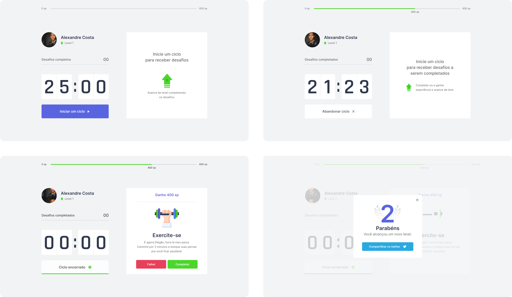

<h1 align="center">
  
  <br />
  <a href="https://www.linkedin.com/in/alexandre-costa-401699199">
    
  </a>
  <a href="https://github.com/alexandredev3/moveit-nlw4/blob/master/LICENSE.txt">
    
  </a>
  <a href="https://github.com/alexandredev3/moveit-nlw4/issues">
    
  </a>
  <a href="https://github.com/alexandredev3/moveit-nlw4/network">
    
  </a>
  <a href="https://github.com/alexandredev3/moveit-nlw4/stargazers">
    
  </a>
</h1>
<p align="center">
  <a href="#page_facing_up-descrição">Descrição</a>&nbsp;&nbsp;&nbsp;|&nbsp;&nbsp;&nbsp;
  <a href="#art-Layout">Layout</a>&nbsp;&nbsp;&nbsp;|&nbsp;&nbsp;&nbsp;
  <a href="#-tecnologias">Tecnologias</a>&nbsp;&nbsp;&nbsp;|&nbsp;&nbsp;&nbsp;
  <a href="#clipboard-Funcionalidades">Funcionalidades</a>&nbsp;&nbsp;&nbsp;|&nbsp;&nbsp;&nbsp;
  <a href="#closed_book-instalação">Instalação</a>&nbsp;&nbsp;&nbsp;|&nbsp;&nbsp;&nbsp;
  <a href="#man-Autor">Autor</a>&nbsp;&nbsp;&nbsp;|&nbsp;&nbsp;&nbsp;
  <a href="#memo-Licença">Licença</a>
</p>



## :page_facing_up: Descrição
O Move.it é um app que usa a técnica de Pomodoro, esse app faz com que pessoas que passa muito tempo na frente do computador realizar exercícios físicos.

## :art: Layout
Você pode acessar o Layout pelo <a href="https://www.figma.com">Figma<a> atravês <a href="https://www.figma.com/file/ge20pu3ofMOKoliUyKx1Nl/Move.it-1.0">desse link<a>.

## 🛠 Tecnologias
Este projeto foi desenvolvido com as seguintes tecnologias

- [Next.js](https://nextjs.org/)
- [React.js](https://pt-br.reactjs.org/)
- [TypeScript](https://www.typescriptlang.org/)
- [StyledComponents](https://styled-components.com/)

## :clipboard: Funcionalidades
- [x] Iniciar um ciclo de 25 minutos.
- [x] Abadornar ciclo.
- [x] Dispara um efeito sonoro quando o ciclo chega ao fim.
- [x] Manda uma notificação quando o ciclo chega ao seu fim.
- [x] A cada ciclo libera um novo desafio.
- [x] Usuário ganha XP a cada desafio concluído.
- [x] Usuário pode subir de nível.


## :closed_book: Instalação

### Pré-requisitos
Antes de começar, você vai precisar ter instalado em sua máquina as seguintes ferramentas:
[Git](https://git-scm.com), [Node.js](https://nodejs.org/en/), Além disto é bom ter um editor para trabalhar com o código como [VSCode](https://code.visualstudio.com/)

```bash
# Clone este repositório.
$ git clone https://github.com/alexandredev3/moveit-nlw4.git

# Vá para a pasta moveit-nlw4
$ cd moveit-nlw4

# Instale as dependências
$ npm install 

# Execute aplicação
$ npm run dev

# O app vai está rodando na porta 3000 - acesse <http://localhost:3000>
```

## :man: Autor

<a href="https://github.com/alexandredev3/">
 
 <br />
 <sub><b>Alexandre Costa</b></sub>
</a>


Feito com ❤️ por Alexandre Costa :wave::wave: Entre em contato!🚀

<a href="https://www.linkedin.com/in/alexandre-costa-401699199">
  
</a>


## :memo: Licença

Copyright © 2020 [Alexandre Costa](https://github.com/alexandredev3).<br />
This project is [MIT](./LICENSE.txt) licensed.
